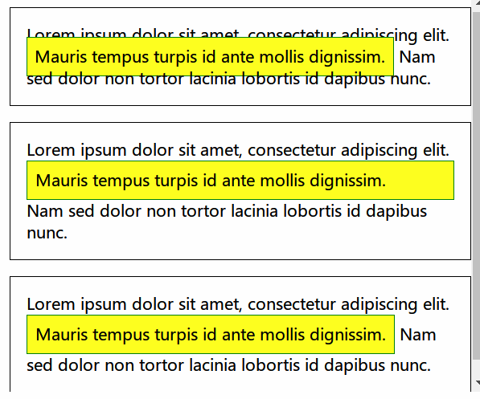

### 　`inline`的特点

- 对行内盒设置宽高无效

### `inline-block`的特点

- 上下布局展示`block`的特点，
- 左右布局展示`inline`的特点


值得注意的是`inline`元素的`padding`会被无视，相关 CSS 代码：

```css
p {
    padding: 1em;
    border: 1px solid black;
}

span {
    padding: 0.5em;
    border: 1px solid green;

    /* That makes the box visible, regardless of its type */
    background-color: yellow;
}

.inline {
    display: inline;
}

.block {
    display: block;
}

.inline-block {
    display: inline-block;
}
```

### 浮动

- `float: left`：当前行盒子开始的位置，碰到一个浮动元素后继续向左排列，直到下一行
- `right: right`：当前行盒子尾部位置

## `position`属性的值

- static: 正常布局，此时 top right bottom left 属性无效
- relative: 在 static 的基础上偏离 top 等值，原来的位置会留下空白
- absolute：补位元素预留空间，通过指定元素相对于最近的非 static 定位的祖先元素的偏移来确定位置，当这样的祖先元素不存在时，则相对于 ICB（inital container block, 初始包含块）（**？**
  ），可使用外边距，且不会与其他边距合并
- fixed: 不为元素预留空间，指定相对与屏幕视窗的位置来指定元素位置

## 遇到的问题

[视觉格式化模型
](https://developer.mozilla.org/zh-CN/docs/Web/Guide/CSS/Visual_formatting_model)中关于

- 块级盒子
- 块盒子
- 块容器盒子 概念的区分

## 　重要的文档

[视觉格式化模型
](https://developer.mozilla.org/zh-CN/docs/Web/Guide/CSS/Visual_formatting_model)

[CSS: position](https://developer.mozilla.org/zh-CN/docs/Web/CSS/position)

## margin 折叠值的计算

- 都为正值时，取最大的
- 包含负值时，取最大的正 margin 与最小的负 margin（即最大的绝对值）的值的和
- 全为负值时，最小的负 margin 的值

## margin 负边距定位

- padding 撑大边界，负 margin 收缩边界
- A、B、C 三个盒子横向排列，B 设置负边距，B 会占据 A 的空间，C 也会随 B 移动，直至遇到 A
- A、B、C 三个盒子纵向排列，B 设置负边距，B 会占据 A 的空间，C 也会随 B 移动
- 负 margin 会造成盒子向上漂浮移动

## `clear`: 清除浮动属性

元素向下移动，使得设定的边来避开浮动元素

## 包含块的判断

- 如果 position 属性为 static 或 relative ，包含块就是由它的最近的祖先块元素
- 如果 position 属性为 absolute ，包含块就是由它的最近的 position 的值不是 static 的祖先元素的内边距区的边缘组成。
- 如果 position 属性是 fixed，包含块就是由 viewport 组成的。
- 参考资料：[布局和包含块](https://developer.mozilla.org/zh-CN/docs/Web/CSS/All_About_The_Containing_Block)
